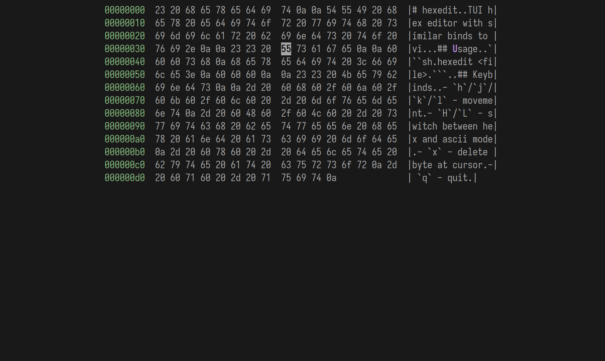

# hexedit

TUI hex editor with similar binds to vi.



## Usage

```sh
hexedit <file>
```

## Keybinds

- `h`/`j`/`k`/`l` - movement
- `H`/`L` - switch between hex and ascii mode
- `x` - delete byte at cursor
- `q` - quit
